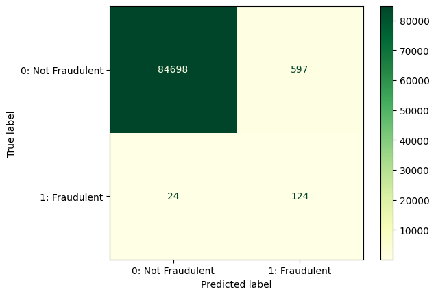
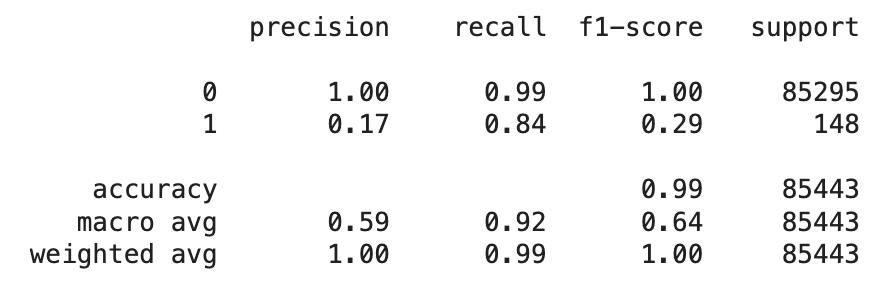
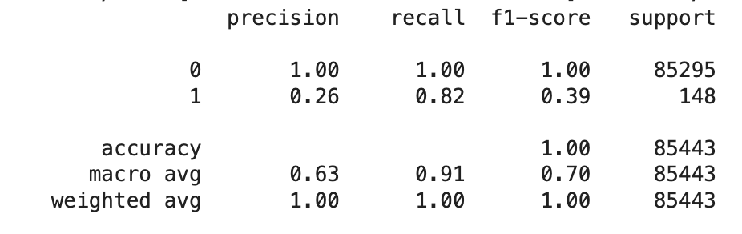

## Overview

Credit card fraud is when an unauthorized purchase is made using a stolen credit card or credit card number. At present, it is one of the most common form of identity theft. My objective is to build an optimized prediction and anomaly detection model for fraudulent credit card transactions.

## EDA

This dataset contains about 280,000 credit card transactions within 2 days in September by European cardholders. It was collected and analyzed during a research collaboration of Worldline and the Machine Learning Group of Université Libre de Bruxelles. Downloaded from <a href="https://www.kaggle.com/datasets/mlg-ulb/creditcardfraud" target="new">Kaggle</a>.

Noting that this data was already run with PCA for dimensionality reduction to protect user identities and sensitive features. This excludes the feature Time, which time between when transactions are made, and the Amount feature of the transaction. Class is the target. 1 for fraudulent transactions, 0 for not fraudulent.

In this dataset, there are only 492 fraudulent cases! This means, about 99.8% of the data are legitimate transactions, and only about 0.2% is fraudulent.

## Predictive Models

For prediction, I ran these models in different Jupyter notebooks: Logistic Regression, Decision Tree, Random Forest, Gradient Boosting, and Neural Network.

Best model: Logistic Regression

Not bad results on the baseline. Overall accuracy is 99% and type 1 recall is at 84%. A lot more False Positives (model flagged a Not Fraudulent transaction as Fraudulent) than True Positives, but with credit card fraud that is a lot safer than the amount of False Negatives (model flagged a Fraudulent transaction as Not Fraudulent!) , which is very low. Also my fastest model.

After tuning with C at 100, results have the same metrics. However, some of the False Positives moved into True Positives. The False Negatives and True Negatives count remained the same.

Alternative model: Neural Network

## Important Features

Using recursive feature elimination with cross-validation, these were the top 3 important features for more analysis.

<ol>
<li>V4</li>
<li>V5</li>
<li>V8</li>
</ol>

## Anomaly Detection Models

Built baseline Isolation Forest and SVM models that need tuning. I suspect that my baseline SVM model is doing poorly because it is picking up a lot of False Positives similar to Isolation Forest.

## Next Steps

Continue to tune both best predictive models to improve recall scores and improve anomaly detection models.

## Sources

<a href="https://www.investopedia.com/ask/answers/09/stolen-credit-card.asp" target="new">Investopeida</a>, Who Is Liable for Credit Card Fraud?

<a href="https://www.sciencedirect.com/science/article/pii/S2214212623002028" target="new">ScienceDirect</a>"An ensemble learning approach for anomaly detection in credit card data with imbalanced and overlapped classes"